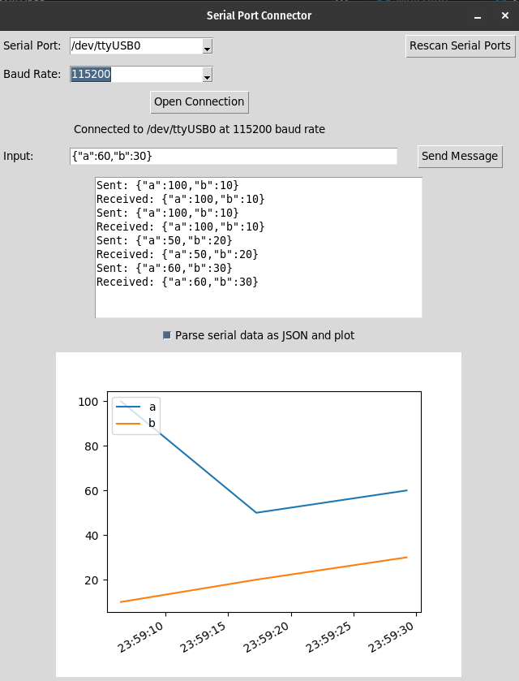

# Serial Port Connector

Serial Port Connector is a Python application that facilitates serial communication through a simple GUI. Users can connect to available serial ports, configure the baud rate, and send/receive messages to/from connected serial devices.

## Requirements

- Python 3.6 or higher
- Tkinter
- PySerial

## Installation

Before running the Serial Port Connector, ensure that you have Python and the necessary packages installed. Here's how you can set it up:

### 1. Install Python

If you don't already have Python installed, download and install it from the [Python official website](https://www.python.org/).

### 2. Install Tkinter

Tkinter is included with Python standard libraries. However, if it is not installed, you can install it using your system's package manager or refer to the [Tkinter installation guide](https://tkdocs.com/tutorial/install.html) for detailed instructions.

### 3. Install PySerial

Open a terminal/command prompt and run the following command to install the PySerial package:

```sh
pip install pyserial
```


### Running the Serial Port Connector

1. Save the Python script to a file, e.g., serial_port_connector.py.
1. Open a terminal/command prompt.
1. Navigate to the directory where serial_port_connector.py is located.
1. Run the script using the following command:

```sh
python serial_port_connector.py
```

### Usage
1. Open the Serial Port Connector application by running the script as described above.
1. Select a serial port and a baud rate from the respective dropdown menus.
1. Click "Open Connection" to establish a connection to the serial device.
1. Once connected, you can send messages to the device by entering text in the "Input" field and clicking "Send Message".
1. Received messages from the device will be displayed in the output box below the "Input" field.
1. To close the connection, simply close the Serial Port Connector application.

### Support
If you encounter any issues or require further assistance, feel free to open an issue in this repository.

### License
MIT License